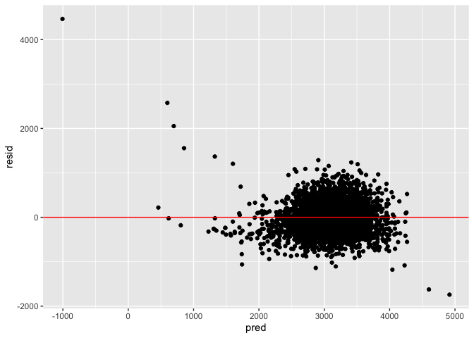
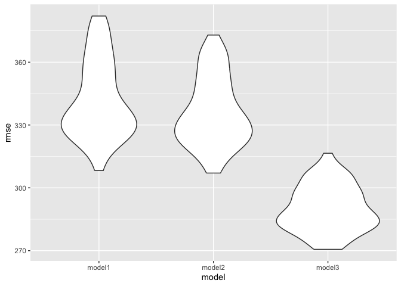

p8105\_hw6\_ga2612
================
Lupe Antonio
12/1/2023

## Problem 1

``` r
#loading data
homicide_data <- read_csv('data_hw6/homicide_data.csv') %>%
  mutate(
    city_state = str_c(city, state, sep = ', '),
    #unsolved == 0, solved == 1
    resolution = case_when(
      disposition == 'Closed without arrest' ~ 0,
      disposition == 'Open/No arrest' ~ 0,
      disposition == 'Closed by arrest' ~ 1),
    #making victime_age numeric
    victim_age = as.numeric(victim_age)) %>%
  #excluding cities
  filter(city_state != 'Dallas, TX',
         city_state != 'Phoenix, AZ',
         city_state != 'Kansas City, MO',
         city_state != 'Tulsa, AL',
        #filtering victim_race
        victim_race == 'White' | victim_race == 'Black')
```

    ## Warning: There was 1 warning in `mutate()`.
    ## ℹ In argument: `victim_age = as.numeric(victim_age)`.
    ## Caused by warning:
    ## ! NAs introduced by coercion

``` r
baltimore_data <- homicide_data %>%
  filter(city_state == 'Baltimore, MD')

#fitting glm model
baltimore_logistic <- baltimore_data %>%
  glm(resolution ~ victim_age + victim_sex + victim_race,
    data = ., family = binomial())


#obtaining estimate
baltimore_logistic %>%
  tidy() %>%
  filter(term == 'victim_sexMale') %>%
  mutate(adj_OR = exp(estimate),
         OR_low = exp(estimate - 1.96 * std.error),
         OR_upper = exp(estimate + 1.96 * std.error)) %>%
  select(term, adj_OR, OR_low, OR_upper)
```

    ## # A tibble: 1 × 4
    ##   term           adj_OR OR_low OR_upper
    ##   <chr>           <dbl>  <dbl>    <dbl>
    ## 1 victim_sexMale  0.426  0.325    0.558

``` r
#obtaining confidence interval for checking purposes
exp(confint(baltimore_logistic)['victim_sexMale', ])
```

    ##     2.5 %    97.5 % 
    ## 0.3241908 0.5575508

``` r
cities_data <- homicide_data %>%
  nest(data = -city_state) %>%
  mutate(
    models = map(data, \(df) glm(resolution ~ victim_age + victim_sex + victim_race,
                                 data = df, family = binomial())),
    tidy_models = map(models, tidy)) %>%
  select(-models, data) %>%
  unnest(cols = tidy_models) %>%
  filter(term == 'victim_sexMale') %>%
  mutate(adj_OR = exp(estimate),
         OR_low = exp(estimate - 1.96*std.error),
         OR_upper = exp(estimate + 1.96*std.error)) %>%
  select(city_state, term, adj_OR, OR_low, OR_upper)

cities_data %>%
  knitr::kable()
```

| city\_state        | term            |   adj\_OR |   OR\_low | OR\_upper |
| :----------------- | :-------------- | --------: | --------: | --------: |
| Albuquerque, NM    | victim\_sexMale | 1.7674995 | 0.8306581 | 3.7609388 |
| Atlanta, GA        | victim\_sexMale | 1.0000771 | 0.6836012 | 1.4630669 |
| Baltimore, MD      | victim\_sexMale | 0.4255117 | 0.3245590 | 0.5578655 |
| Baton Rouge, LA    | victim\_sexMale | 0.3814393 | 0.2092532 | 0.6953103 |
| Birmingham, AL     | victim\_sexMale | 0.8700153 | 0.5742951 | 1.3180098 |
| Boston, MA         | victim\_sexMale | 0.6739912 | 0.3560002 | 1.2760222 |
| Buffalo, NY        | victim\_sexMale | 0.5205704 | 0.2897705 | 0.9352008 |
| Charlotte, NC      | victim\_sexMale | 0.8838976 | 0.5569929 | 1.4026659 |
| Chicago, IL        | victim\_sexMale | 0.4100982 | 0.3359897 | 0.5005527 |
| Cincinnati, OH     | victim\_sexMale | 0.3998277 | 0.2360847 | 0.6771390 |
| Columbus, OH       | victim\_sexMale | 0.5324845 | 0.3782581 | 0.7495933 |
| Denver, CO         | victim\_sexMale | 0.4790620 | 0.2364294 | 0.9706934 |
| Detroit, MI        | victim\_sexMale | 0.5823472 | 0.4622017 | 0.7337235 |
| Durham, NC         | victim\_sexMale | 0.8123514 | 0.3920374 | 1.6832957 |
| Fort Worth, TX     | victim\_sexMale | 0.6689803 | 0.3969391 | 1.1274643 |
| Fresno, CA         | victim\_sexMale | 1.3351647 | 0.5804995 | 3.0709150 |
| Houston, TX        | victim\_sexMale | 0.7110264 | 0.5576715 | 0.9065526 |
| Indianapolis, IN   | victim\_sexMale | 0.9187284 | 0.6794344 | 1.2423006 |
| Jacksonville, FL   | victim\_sexMale | 0.7198144 | 0.5365350 | 0.9657017 |
| Las Vegas, NV      | victim\_sexMale | 0.8373078 | 0.6076753 | 1.1537154 |
| Long Beach, CA     | victim\_sexMale | 0.4102163 | 0.1555148 | 1.0820672 |
| Los Angeles, CA    | victim\_sexMale | 0.6618816 | 0.4581299 | 0.9562510 |
| Louisville, KY     | victim\_sexMale | 0.4905546 | 0.3047208 | 0.7897189 |
| Memphis, TN        | victim\_sexMale | 0.7232194 | 0.5291729 | 0.9884224 |
| Miami, FL          | victim\_sexMale | 0.5152379 | 0.3044831 | 0.8718716 |
| Milwaukee, wI      | victim\_sexMale | 0.7271327 | 0.4987091 | 1.0601810 |
| Minneapolis, MN    | victim\_sexMale | 0.9469587 | 0.4782860 | 1.8748838 |
| Nashville, TN      | victim\_sexMale | 1.0342379 | 0.6847143 | 1.5621816 |
| New Orleans, LA    | victim\_sexMale | 0.5849373 | 0.4217648 | 0.8112381 |
| New York, NY       | victim\_sexMale | 0.2623978 | 0.1379459 | 0.4991275 |
| Oakland, CA        | victim\_sexMale | 0.5630819 | 0.3650924 | 0.8684409 |
| Oklahoma City, OK  | victim\_sexMale | 0.9740747 | 0.6240860 | 1.5203378 |
| Omaha, NE          | victim\_sexMale | 0.3824861 | 0.2029670 | 0.7207853 |
| Philadelphia, PA   | victim\_sexMale | 0.4962756 | 0.3776157 | 0.6522225 |
| Pittsburgh, PA     | victim\_sexMale | 0.4307528 | 0.2650983 | 0.6999213 |
| Richmond, VA       | victim\_sexMale | 1.0060520 | 0.4979508 | 2.0326120 |
| San Antonio, TX    | victim\_sexMale | 0.7046200 | 0.3976578 | 1.2485342 |
| Sacramento, CA     | victim\_sexMale | 0.6688418 | 0.3347138 | 1.3365132 |
| Savannah, GA       | victim\_sexMale | 0.8669817 | 0.4222665 | 1.7800544 |
| San Bernardino, CA | victim\_sexMale | 0.5003444 | 0.1712084 | 1.4622204 |
| San Diego, CA      | victim\_sexMale | 0.4130248 | 0.1995220 | 0.8549909 |
| San Francisco, CA  | victim\_sexMale | 0.6075362 | 0.3167902 | 1.1651253 |
| St. Louis, MO      | victim\_sexMale | 0.7031665 | 0.5303670 | 0.9322661 |
| Stockton, CA       | victim\_sexMale | 1.3517273 | 0.6211368 | 2.9416496 |
| Tampa, FL          | victim\_sexMale | 0.8077029 | 0.3477529 | 1.8759988 |
| Tulsa, OK          | victim\_sexMale | 0.9757694 | 0.6135882 | 1.5517343 |
| Washington, DC     | victim\_sexMale | 0.6901713 | 0.4683853 | 1.0169757 |

``` r
cities_data %>%
  mutate(city_state = fct_reorder(city_state, adj_OR)) %>%
  ggplot(aes(x = city_state, y = adj_OR)) +
  geom_point() +
  geom_errorbar(aes(ymin = OR_low, ymax = OR_upper)) +
  theme(axis.text.x = element_text(angle = 90, hjust = 1))
```

<!-- -->

From the table above, we can see that the majority of cities have
adjusted odds ratio less than 1. This suggest that among crimes against
Males they have lower odds of resolution compared to crimes against
Females, after controlling for the victims age and race.

## Problem 2

``` r
#loading data
weather_df <- 
  rnoaa::meteo_pull_monitors(
    c("USW00094728"),
    var = c("PRCP", "TMIN", "TMAX"), 
    date_min = "2022-01-01",
    date_max = "2022-12-31") %>%
  mutate(
    name = recode(id, USW00094728 = "CentralPark_NY"),
    tmin = tmin / 10,
    tmax = tmax / 10) %>%
  select(name, id, everything())
```

    ## using cached file: /Users/lupeantonio/Library/Caches/org.R-project.R/R/rnoaa/noaa_ghcnd/USW00094728.dly

    ## date created (size, mb): 2023-12-02 13:49:50.02986 (8.544)

    ## file min/max dates: 1869-01-01 / 2023-11-30

``` r
#fitting SLR model
model_p2 <- lm(tmax ~ tmin + prcp, data = weather_df)
```

``` r
#bootstrapping
bootstrap_results <- weather_df %>%
  modelr::bootstrap(n = 5000) %>%
  mutate(
    models = map(strap, \(df) lm(tmax ~ tmin + prcp, data = df)),
    estimates = map(models, tidy),
    results = map(models, glance)) %>%
  select(-strap, -models) %>%
  unnest(estimates, results) %>%
  select(term, estimate, r.squared) %>%
  filter(term == 'tmin' | term == 'prcp') %>%
  pivot_wider(names_from = 'term',
              values_from = 'estimate') %>%
  mutate(log_estimates = log(tmin * prcp))
```

    ## Warning: `unnest()` has a new interface. See `?unnest` for details.
    ## ℹ Try `df %>% unnest(c(estimates, results))`, with `mutate()` if needed.

    ## Warning: There was 1 warning in `mutate()`.
    ## ℹ In argument: `log_estimates = log(tmin * prcp)`.
    ## Caused by warning in `log()`:
    ## ! NaNs produced

``` r
#plotting log estimates
bootstrap_results %>%
  ggplot(aes(x = log_estimates)) +
  geom_density()
```

    ## Warning: Removed 3435 rows containing non-finite values (`stat_density()`).

<!-- -->
Based on the plot above, we can see that the majority of samples
produced by bootstrapping are concentrated around similar values,
somewhere between -6 and -3. This is further supported by the confidence
intervals below.

``` r
#plotting for r-squared
bootstrap_results %>%
  ggplot(aes(x = r.squared)) +
  geom_density()
```

<!-- -->
Based on the plot above, we can see that the r-squared values produced
by bootstrapping have a small spread as well. The confidence interval is
also small. This is consistent with values/estimates becoming fairly
similar due bootstrapping becoming closer to normal distribution.

``` r
#confidence interval
bootstrap_results %>%
  summarize(
    ci_lower_r = quantile(r.squared, 0.025, na.rm = T),
    ci_upper_r = quantile(r.squared, 0.975, na.rm = T),
    
    ci_lower_logestimates = quantile(log_estimates, 0.025, na.rm = T),
    ci_upper_logestimates = quantile(log_estimates, 0.975, na.rm = T))
```

    ## # A tibble: 1 × 4
    ##   ci_lower_r ci_upper_r ci_lower_logestimates ci_upper_logestimates
    ##        <dbl>      <dbl>                 <dbl>                 <dbl>
    ## 1      0.890      0.941                 -8.68                 -4.53

## Problem 3

``` r
birthweight <- read_csv('data_hw6/birthweight.csv') %>%
  mutate(
    babysex = as.factor(babysex),
    frace = as.factor(frace),
    malform = as.factor(malform),
    mrace = as.factor(mrace))
```

    ## Rows: 4342 Columns: 20
    ## ── Column specification ────────────────────────────────────────────────────────
    ## Delimiter: ","
    ## dbl (20): babysex, bhead, blength, bwt, delwt, fincome, frace, gaweeks, malf...
    ## 
    ## ℹ Use `spec()` to retrieve the full column specification for this data.
    ## ℹ Specify the column types or set `show_col_types = FALSE` to quiet this message.

Describe your modeling process

Make this comparison in terms of the cross-validated prediction error;
use crossv\_mc and functions in purrr as appropriate.

``` r
#no missing data
birthweight[!complete.cases(birthweight), ]
```

    ## # A tibble: 0 × 20
    ## # ℹ 20 variables: babysex <fct>, bhead <dbl>, blength <dbl>, bwt <dbl>,
    ## #   delwt <dbl>, fincome <dbl>, frace <fct>, gaweeks <dbl>, malform <fct>,
    ## #   menarche <dbl>, mheight <dbl>, momage <dbl>, mrace <fct>, parity <dbl>,
    ## #   pnumlbw <dbl>, pnumsga <dbl>, ppbmi <dbl>, ppwt <dbl>, smoken <dbl>,
    ## #   wtgain <dbl>

``` r
#regression model
model_p3 <- lm(bwt ~ babysex + blength + fincome + smoken,
               data = birthweight)


#plot for model
birthweight %>%
  add_residuals(model_p3) %>%
  add_predictions(model_p3) %>%
  ggplot(aes(x = pred, y = resid)) +
  geom_point() +
  geom_hline(yintercept = 0, color = 'red')
```

<!-- --> To
create my model, I took into consideration which factors/variables I
believed would be most influential to a baby’s birthweight. Based on
working on similar datasets in the past, I believed that the sex, length
are great influential factor. Other things to greatly consider as the
mothers behaviors, which can be influenced by money and where the mother
smokes or not.

``` r
#model 2
model2_p3 <- lm(bwt ~ blength + gaweeks,
                data = birthweight)

#model 3
model3_p3 <- lm(bwt ~ bhead + blength + babysex + bhead*blength + bhead*babysex + blength*babysex +
                  bhead*blength*babysex,
                data = birthweight)
```

``` r
#creating training & testing data
cv_birthweight <-
  crossv_mc(birthweight, 100)
```

``` r
cv_birthweight <- cv_birthweight %>%
  mutate(
    model_p3 = map(train, \(df) lm(bwt ~ babysex + blength + fincome + smoken, data = df)),
    model2_p3 = map(train, \(df) lm(bwt ~ blength + gaweeks, data = df)),
    model3_p3 = map(train, \(df) lm(bwt ~ bhead + blength + babysex + bhead*blength + bhead*babysex + blength*babysex +
                  bhead*blength*babysex, data = df))) %>%
  mutate(
    
    rmse_model1 = map2_dbl(model_p3, test, \(mod, df) rmse(model = mod, data = df)),
    rmse_model2 = map2_dbl(model2_p3, test, \(mod, df) rmse(model = mod, data = df)),
    rmse_model3 = map2_dbl(model3_p3, test, \(mod, df) rmse(model = mod, data = df)))
```

``` r
#plotting
cv_birthweight %>%
  select(starts_with('rmse')) %>%
  pivot_longer(
    everything(),
    names_to = 'model',
    values_to = 'rmse',
    names_prefix = 'rmse_') %>%
  mutate(model = fct_inorder(model)) %>%
  ggplot(aes(x = model, y = rmse)) +
  geom_violin()
```

<!-- -->

Based on the plot above, we can see that my model did not do too well
compared to the other two models. It had a large RMSE value.
